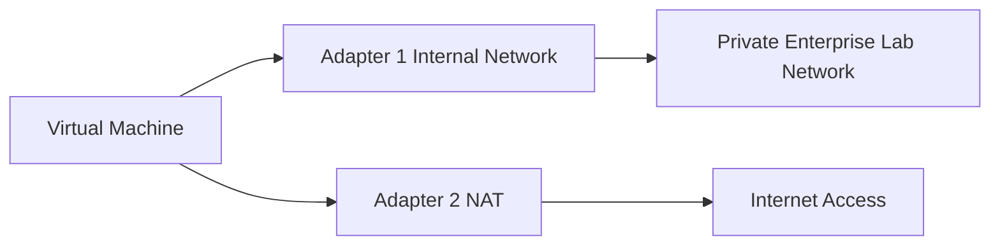

# Phase 2: Virtual Network Design

Each VM was configured with two network adapters to separate enterprise lab traffic from internet access.



## Adapter 1: Internal Network

Adapter 1 is used for private enterprise communication between lab machines.

Purpose:

- Active Directory traffic
- DNS traffic
- Kerberos authentication
- SMB communication
- LDAP communication
- Domain workstation communication

Configuration steps:

1. Power off the VM.
2. Open `Settings -> Network`.
3. Enable `Adapter 1`.
4. Set `Attached to` as `Internal Network`.
5. Use the same internal network name for all lab systems.
6. Save the configuration.

All three systems must use the same internal network name. If one machine uses a different internal network name, it will be isolated from the others.

## Adapter 2: NAT

Adapter 2 is used for internet access through the host machine.

Purpose:

- Windows updates
- Linux package installation
- Browser access
- Internet-based downloads

Configuration steps:

1. Power off the VM.
2. Open `Settings -> Network`.
3. Enable `Adapter 2`.
4. Set `Attached to` as `NAT`.
5. Save the configuration.
6. Boot the VM and verify internet access.

## Network Verification

Windows systems:

```cmd
ipconfig
ipconfig /all
```

Linux system:

```bash
ip a
ip route
```

Expected result:

- Each VM has an internal network adapter.
- Each VM has a NAT adapter.
- Internal traffic stays inside the lab.
- NAT traffic provides outbound internet access.
