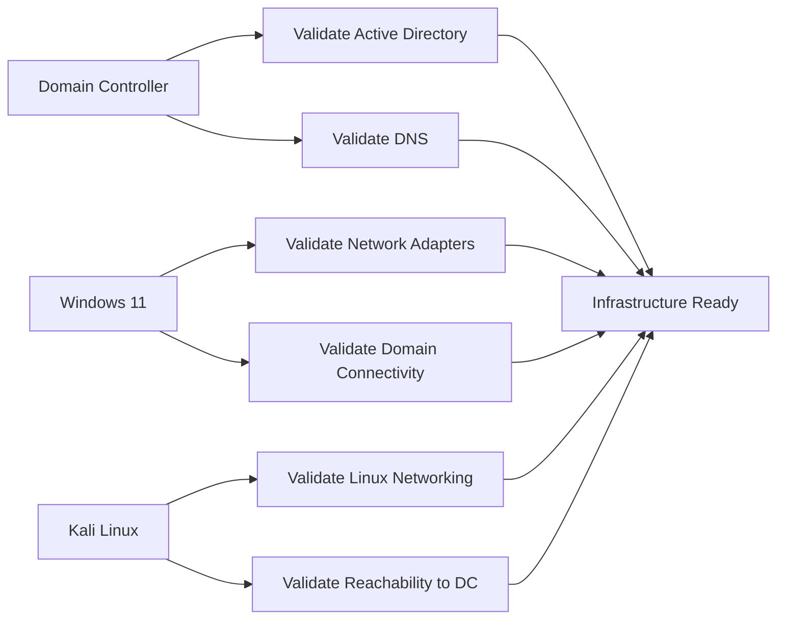

# Phase 9: Infrastructure Validation

After all systems were deployed, the lab was validated from the domain controller, Windows 11 workstation, and Kali Linux VM.

## Validation Flow



## Domain Validation

Run on the domain controller:

```powershell
Get-ADDomain
```

This confirms that Active Directory is available and that the server recognizes the `corp.local` domain.

## Windows Network Validation

Run on Windows Server 2022 and Windows 11:

```cmd
ipconfig
ipconfig /all
```

This confirms that Windows systems have the expected network adapters and DNS configuration.

## Linux Network Validation

Run on Kali Linux:

```bash
ip a
ip route
```

This confirms that Kali has active network interfaces and routing.

## Full Validation Checklist

- Domain controller is online.
- `corp.local` exists as the Active Directory domain.
- DNS role is installed.
- DNS zone exists for `corp.local`.
- Windows 11 can see its internal and NAT adapters.
- Kali can see its internal and NAT adapters.
- Internal network connectivity exists between lab machines.
- NAT internet access works where needed.
- ADUC opens and displays `corp.local`.
- ADAC opens and displays `corp.local`.
