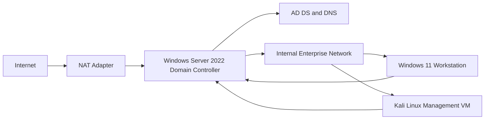
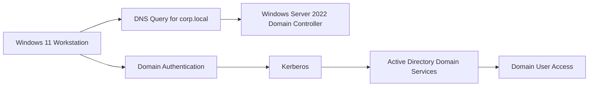
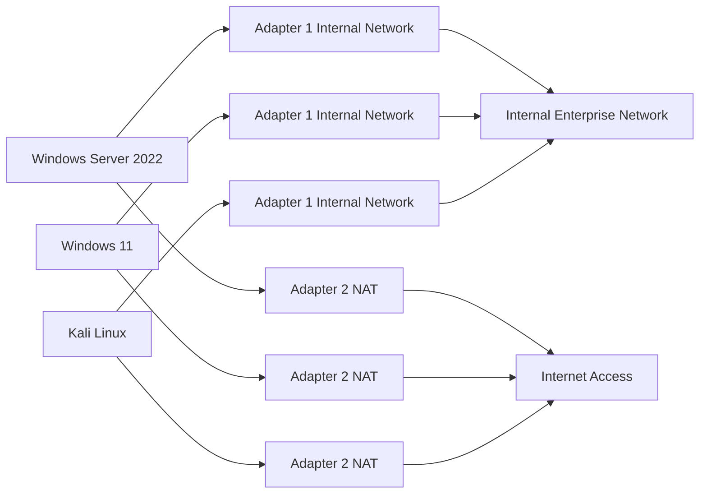
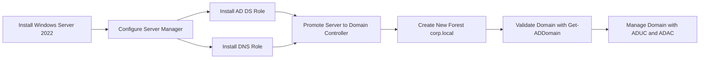

# Architecture

This lab uses three virtual machines connected through a private VirtualBox internal network. A second NAT adapter provides internet access for updates and package installation.

## High-Level Network Topology

## Enterprise Service Flow

## VirtualBox Adapter Layout

## Domain Deployment Flow

## Lab Systems

| System | Network Role | Infrastructure Function |
| --- | --- | --- |
| Windows Server 2022 | Core server | Domain controller, AD DS, DNS |
| Windows 11 Pro | Domain workstation | Enterprise client endpoint |
| Kali Linux | Linux management VM | Network validation and administration |

## Network Purpose

| Network | Purpose |
| --- | --- |
| Internal Network | Isolated enterprise communication for AD DS, DNS, Kerberos, SMB, and LDAP |
| NAT | Internet access for updates, browser access, and package installation |
