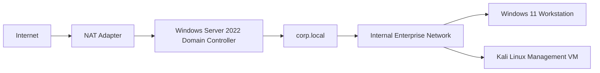
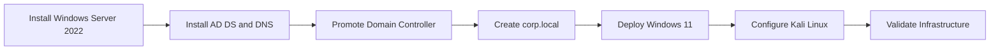

# Architecture

This lab uses three virtual machines connected through a private VirtualBox internal network. A second NAT adapter provides internet access for updates and package installation.

## High-Level Network Topology

## Domain Deployment Flow

## Network Purpose

| Network | Purpose |
| --- | --- |
| Internal Network | Isolated enterprise communication for AD DS, DNS, Kerberos, SMB, and LDAP |
| NAT | Internet access for updates, browser access, and package installation |
